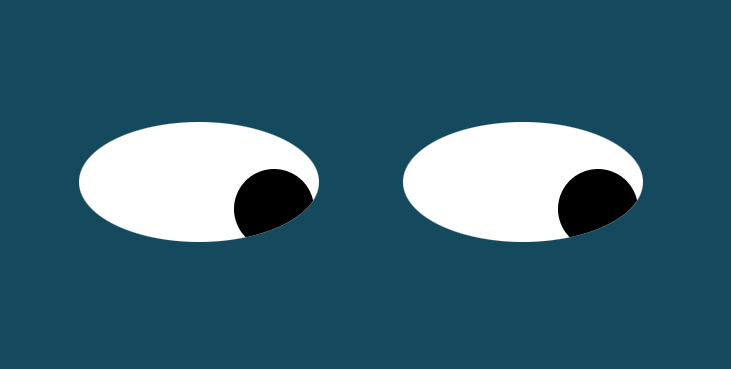

# Eyes
This project uses CSS and JS to display 2 eyes that follow the mouse cursor

## Table of Contents
* [Screenshot](#screenshot)
* [Setup](#setup)
* [Usage](#usage)
* [Room for Improvement](#room-for-improvement)
* [Acknowledgements](#acknowledgements)
* [Contact](#contact)
* [License](#license)

## Screenshot

## Setup
- On Github, navigate to the main page of this repository.
- On the top right of the list of files, click the green button, titled 'Code'.
- Copy the URL by clicking on the clipboard button.
- Open Gitbash.
- Change the current working directory to where you want the cloned directory.
- Type:  $ git clone https://github.com/Mitsananikone/Eyes.
- Press 'Enter' to create your local clone.
- Run index.html.

## Usage
Once index.html is open, you will see a blue screen with 2 eyes, looking at the user.   
The 2 eye balls will follow the mouse cursor where ever it is on the screen.  
This is achieved using the '.onmousemove' event to the move the eyeballs to follow the cursor using the inner window dimensions.  
A loop (which iterates 2 times -for 2 eyes) updates the eye ball images to follow the cursor.

## Room for Improvement
Something I've thought about was to change the way the eyes follow the mouse cursor.  
Instead of using the window.innerWidth & window.innerHeight, I thought maybe there was a way  
to do it using mouse position [x,y], so that its posible to make the eyes go cross-eyed.

## Acknowledgements
- This project was inspired by Week 8 of the M.I.T Fullstack Developer Bootcamp

## Contact
Created by [@mitsananikone(https://mitsananikone.github.io/)] - feel free to contact me!

## License

